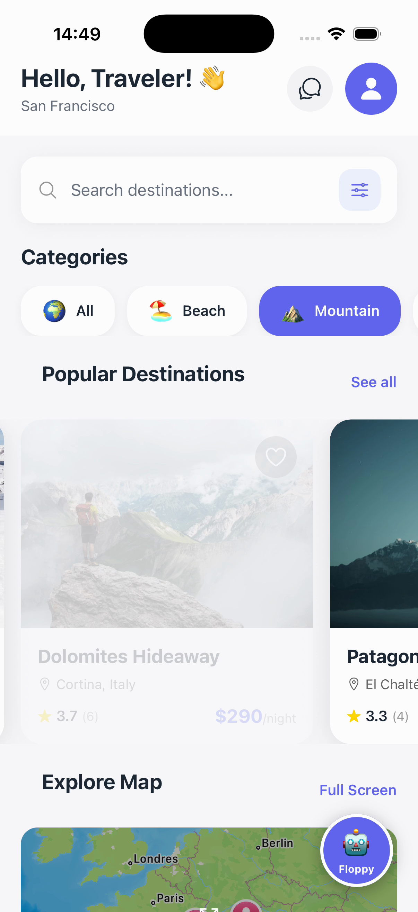
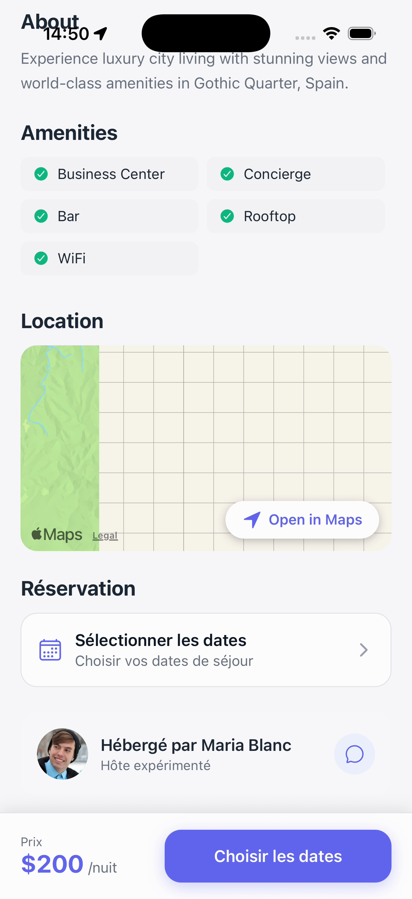
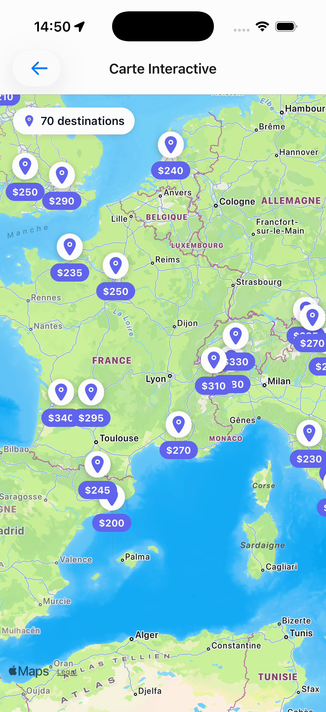
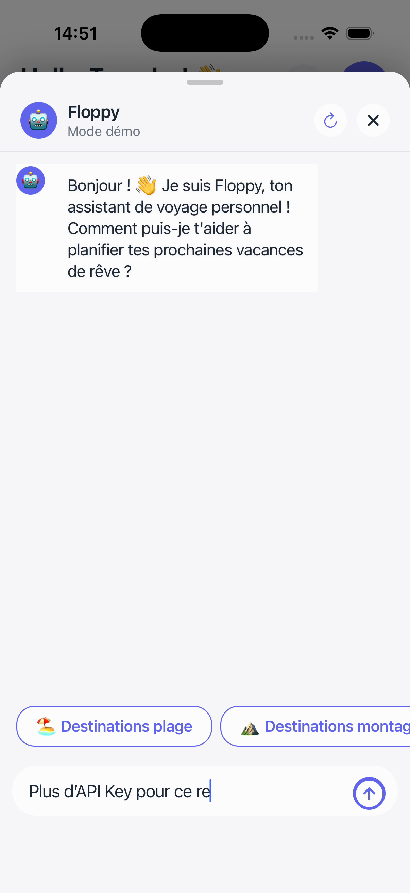
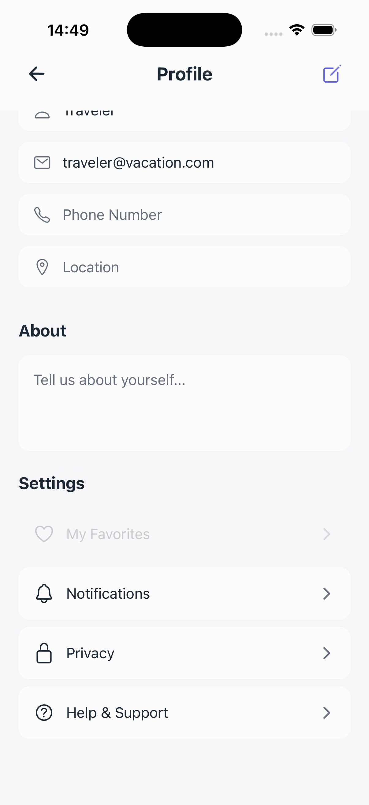
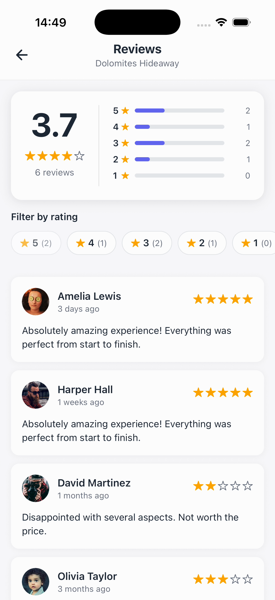
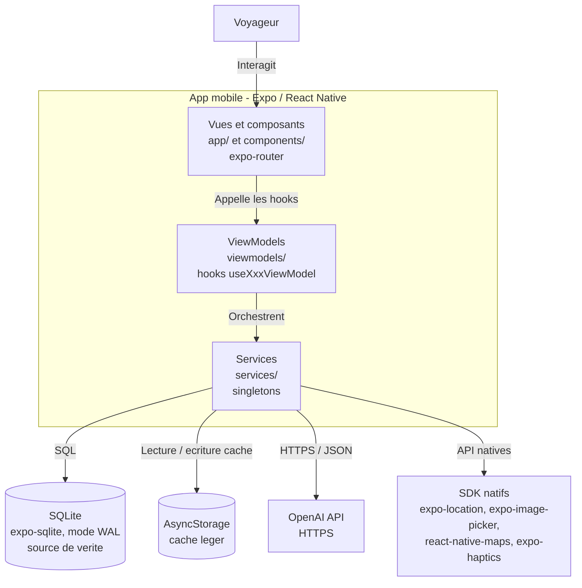

# App-test — Application mobile de réservation de séjours

Application mobile de réservation de vacances : découverte de destinations, favoris, chat avec l'hôte, assistant IA et réservations, le tout construit en **React Native / Expo** selon une architecture **MVVM**.


---

## Aperçu / Captures d'écran

### Écrans requis

| Authentification (Onboarding) | Liste principale (Accueil) |
|:---:|:---:|
|  |  |
| Écran d'entrée et slides de présentation (parcours non authentifié). | « Hello, Traveler! » : recherche, catégories et destinations. |

| Détail d'une destination | Fonctionnalité native (carte) |
|:---:|:---:|
|  |  |
| Équipements, carte de localisation et bloc de réservation. | Carte interactive plein écran : 16 destinations et marqueurs. |

### Autres écrans

| Chat avec l'hôte (état d'erreur) | Assistant IA « Floppy » | Profil utilisateur | Avis / notes |
|:---:|:---:|:---:|:---:|
|  |  |  |  |
| Appel OpenAI en erreur (clé manquante). | Assistant de voyage conversationnel. | Édition du profil + photo. | Note globale et filtres par étoiles. |

---

## Vidéo de démonstration

[Voir la vidéo de démonstration]([LIEN_VIDEO])

> La vidéo `.mov` (~326 Mo) n'est pas versionnée dans Git car trop lourde. Elle est hébergée à part (Google Drive ou YouTube en mode non répertorié) ; remplacez le placeholder `[LIEN_VIDEO]` par le lien d'hébergement.

Le **chapitrage détaillé** (navigation, CRUD, persistance, appels API, gestion des états, fonctionnalités natives), horodaté image par image, est disponible dans [`docs/DEMO-SCRIPT.md`](docs/DEMO-SCRIPT.md).

La vidéo démontre :

- **Navigation complète** : enchaînement Onboarding → Accueil → Profil → Reviews → Détail → Carte plein écran → Chat hôte → Floppy.
- **CRUD** : ajout/retrait d'un favori, édition du profil, création d'un message de chat (écritures SQLite).
- **Persistance** : favoris, profil + photo et messages de chat conservés en base.
- **Appels API** : chat avec l'hôte et assistant Floppy via l'API OpenAI.
- **Gestion des états** : chargement des listes/réponses, état d'erreur du chat, mode démo de Floppy.
- **Fonctionnalité native** : carte interactive, géolocalisation, calendrier de dates et sélection de photo.

---

## Fonctionnalités implémentées

### Authentification / Onboarding
Écran d'entrée non authentifié avec slides de présentation et retours haptiques.
`app/(vacation)/onboarding.tsx`

### Liste principale, recherche, filtres et catégories
Accueil « Hello, Traveler! » avec barre de recherche (**debounce de 300 ms**), filtres par catégories (Beach, Mountain, City, Countryside) et listes de destinations (populaires + recommandations).
`app/(vacation)/home.tsx`, `app/(vacation)/all-destinations.tsx`

### Détail d'une destination
Galerie d'images, équipements, carte de localisation native, sélection des dates au calendrier et bloc de réservation.
`app/(vacation)/destination/[id].tsx`

### CRUD complet et persistant
- **Favoris** : ajout / retrait (mise à jour optimiste, persistée en SQLite).
- **Profil** : modification des informations + changement de photo.
- **Messages de chat** : création / effacement de l'historique de conversation.
- **Réservations** : création, **annulation** et **suppression** via l'écran « Mes réservations ».
`app/(vacation)/favorites.tsx`, `app/(vacation)/profile.tsx`, `app/(chat)/[destinationId].tsx`, `app/(vacation)/bookings.tsx`

### Persistance des données
- **SQLite** (`expo-sqlite`, mode WAL) comme source de vérité : **7 tables** (`user_profile`, `destinations`, `favorites`, `reviews`, `hosts`, `chat_messages`, `bookings`).
- **AsyncStorage** comme cache léger (favoris, préférences, profil).
`services/DatabaseService.ts`, `services/StorageService.ts`

### Appels API (OpenAI)
- **Chat avec l'hôte** via `gpt-3.5-turbo` (appel `fetch` direct).
- **Assistant Floppy** via `gpt-4o-mini` (SDK `openai`), avec réponses de secours.
`services/ChatService.ts`, `services/FloppyAIService.ts`

### Gestion des états
- **Chargement** : `ActivityIndicator` pendant le chargement des listes et des réponses IA.
- **Erreur** : message + toast d'erreur si l'appel OpenAI du chat échoue.
- **Vide** : écrans dédiés pour favoris, avis et conversations sans contenu.

### Fonctionnalités natives
- **Carte** interactive avec marqueurs (`react-native-maps`).
- **Géolocalisation** et géocodage inversé (`expo-location`).
- **Appareil photo / galerie** pour la photo de profil (`expo-image-picker`).
- **Retours haptiques** sur les interactions clés (`expo-haptics`).

---

## Architecture

L'application suit le patron **MVVM** (Model — View — ViewModel). Les **Vues** (écrans `expo-router`) ne contiennent que de l'affichage et délèguent toute la logique à des **ViewModels** exposés sous forme de hooks React (`useXxxViewModel`). Ces ViewModels orchestrent des **Services** singletons (accès aux données SQLite, API OpenAI, capteurs natifs) et exposent à la Vue un état prêt à l'emploi. Le flux de dépendance est strict et descendant — une Vue n'appelle qu'un ViewModel, un ViewModel n'appelle que des Services, et seuls les Services touchent les magasins de données ou les systèmes externes — ce qui rend la logique testable, réutilisable entre écrans et indépendante du rendu.

### Diagramme C4 — Niveau 2 (Conteneurs)



Voir [`docs/ARCHITECTURE.md`](docs/ARCHITECTURE.md) pour les **3 niveaux C4** (Contexte, Conteneurs, Composants) et les **diagrammes de séquence** (liste des destinations, favoris optimistes, chat hôte, création de réservation).

---

## Choix techniques

| Besoin | Technologie | Justification |
|---|---|---|
| Framework mobile | **Expo SDK 54 / React Native 0.81** | Développement cross-platform iOS/Android/web avec un seul code base et un tooling intégré (Expo Go, build, OTA). |
| Langage | **TypeScript (strict)** | Typage statique des modèles et des services : moins d'erreurs, meilleure autocomplétion, refactoring sûr. |
| Navigation | **expo-router** (routes typées) | Navigation par fichiers, groupes de routes `(vacation)`/`(chat)`/`(adv)`, et `typedRoutes` pour des liens vérifiés à la compilation. |
| Architecture | **MVVM** | Sépare Vue, logique de présentation et accès aux ressources ; écrans déclaratifs et logique réutilisable/testable. |
| Base locale | **expo-sqlite** (mode WAL) | Requêtes relationnelles et schéma typé pour ~80 destinations, avis, hôtes, messages et réservations ; source de vérité. |
| Cache | **AsyncStorage** | Cache clé/valeur léger pour accélérer l'affichage initial (favoris, préférences, profil) sans relancer une requête SQL. |
| Intelligence artificielle | **OpenAI** (`gpt-3.5-turbo` + `gpt-4o-mini`) | Deux services distincts : chat avec l'hôte et assistant Floppy, avec persona, modèle et stratégie de secours propres. |
| Carte | **react-native-maps** | Carte native interactive avec marqueurs GPS sur le détail et en plein écran. |
| Géolocalisation | **expo-location** | Permission, position courante, géocodage inversé (ville/pays) et calcul de distance (Haversine). |
| Photos | **expo-image-picker** | Prise de photo (caméra) ou sélection en galerie pour l'avatar du profil, avec recadrage 1:1. |
| Retours haptiques | **expo-haptics** | Feedback léger / moyen / succès pour renforcer les interactions (catégories, favoris, confirmation). |
| Interface (UI) | **@expo/vector-icons**, **expo-image**, **react-native-calendars**, **@react-native-community/slider** | Icônes, images optimisées/préchargées, calendrier de sélection de dates et curseur de filtres de prix. |

---

## Démarrage / Installation

### Prérequis

- **Node.js ≥ 20** et **npm**.
- Pour tester l'application :
  - l'application **Expo Go** (iOS / Android), **ou**
  - un **simulateur iOS** (Xcode) / un **émulateur Android** (Android Studio).

### Installation et lancement

```bash
git clone <repo> && cd app-test
cp .env.example .env        # puis renseigner EXPO_PUBLIC_OPENAI_API_KEY (optionnel)
npm install
npx expo start
```

Dans le terminal Expo, appuyez sur :

- `i` — ouvrir sur le **simulateur iOS** ;
- `a` — ouvrir sur l'**émulateur Android** ;
- `w` — ouvrir dans le **navigateur (web)** ;

ou **scannez le QR code** avec l'application **Expo Go** sur un appareil physique.

### Scripts npm disponibles

| Script | Action |
|---|---|
| `npm run ios` | Démarre Expo et ouvre le simulateur iOS. |
| `npm run android` | Démarre Expo et ouvre l'émulateur Android. |
| `npm run web` | Démarre l'application en version web. |
| `npm run lint` | Lance l'analyse statique (ESLint via `expo lint`). |

### Clé OpenAI (optionnelle)

La clé `EXPO_PUBLIC_OPENAI_API_KEY` est **optionnelle** :

- **Sans clé** : l'assistant **Floppy** bascule en **« mode démo »** (réponses de secours) et le **chat avec l'hôte** affiche un état d'erreur lors de l'envoi.
- **Avec une clé valide** : les **deux** fonctionnent pleinement (chat hôte en `gpt-3.5-turbo`, Floppy en `gpt-4o-mini`).

Obtenez une clé sur <https://platform.openai.com/api-keys>.

---

## Structure du projet

```
app-test/
├── app/                              # Vues + navigation (expo-router)
│   ├── _layout.tsx                   # Layout racine (ThemeProvider, Stack)
│   ├── index.tsx                     # Point d'entree -> onboarding
│   ├── (vacation)/                   # Parcours principal du voyageur
│   │   ├── onboarding.tsx
│   │   ├── home.tsx                  # Accueil + recherche + catégories
│   │   ├── all-destinations.tsx
│   │   ├── destination/[id].tsx      # Detail d'une destination
│   │   ├── favorites.tsx
│   │   ├── reviews.tsx
│   │   ├── profile.tsx
│   │   ├── conversations.tsx
│   │   ├── interactive-map.tsx
│   │   ├── booking-confirmation.tsx
│   │   └── bookings.tsx              # Mes reservations
│   ├── (chat)/                       # Chat avec l'hote
│   │   └── [destinationId].tsx
│   └── (adv)/                        # Bannieres publicitaires
│       └── offer-details.tsx
│
├── components/                       # Composants d'UI reutilisables
│   ├── AdBanner.tsx
│   ├── DateRangePicker.tsx
│   ├── FloppyButton.tsx
│   ├── FloppyChat.tsx
│   └── SearchFilters.tsx
│
├── viewmodels/                       # Logique de presentation (hooks)
│   ├── DestinationViewModel.ts
│   ├── BookingViewModel.ts
│   ├── ChatViewModel.ts
│   ├── FloppyChatViewModel.ts
│   └── UserProfileViewModel.ts
│
├── services/                         # Acces donnees, API, capteurs (singletons)
│   ├── DatabaseService.ts            # SQLite (expo-sqlite, WAL) — 7 tables
│   ├── StorageService.ts             # AsyncStorage (cache)
│   ├── ChatService.ts                # OpenAI gpt-3.5-turbo (chat hote)
│   ├── FloppyAIService.ts            # OpenAI gpt-4o-mini (assistant Floppy)
│   └── LocationService.ts            # expo-location (position, distance)
│
├── models/                           # Interfaces TypeScript du domaine
│   ├── Destination.ts
│   ├── Booking.ts
│   ├── User.ts
│   ├── Host.ts
│   ├── Chat.ts
│   ├── ChatMessage.ts
│   └── SearchFilters.ts
│
├── contexts/
│   └── ThemeContext.tsx              # Theme clair / sombre
│
├── hooks/                            # use-color-scheme, useAdBanner
├── constants/
│   └── Colors.ts                     # Palettes clair / sombre
│
└── docs/
    ├── ARCHITECTURE.md               # 3 niveaux C4 + diagrammes de séquence
    └── DEMO-SCRIPT.md                # Chapitrage de la vidéo de démo
```

---

## Notes & limites

- **Sécurité — clé OpenAI côté client.** Les deux services OpenAI utilisent la clé `EXPO_PUBLIC_OPENAI_API_KEY`, embarquée dans le bundle client (préfixe `EXPO_PUBLIC_`) et donc **extractible**. C'est acceptable pour un projet d'apprentissage ou une démonstration, mais **à proscrire en production** : les appels devraient transiter par un **back-end proxy** conservant la clé côté serveur et appliquant des quotas.
- **Vidéo de démo antérieure à l'écran « Mes réservations ».** La vidéo a été enregistrée **avant** l'ajout de la persistance des réservations (table `bookings`) et de l'écran « Mes réservations ». La **persistance** y est déjà prouvée par trois mécanismes (favoris, profil + photo, messages de chat) ; les réservations ne font que **renforcer** une exigence déjà couverte. Voir la note dédiée dans [`docs/DEMO-SCRIPT.md`](docs/DEMO-SCRIPT.md).
