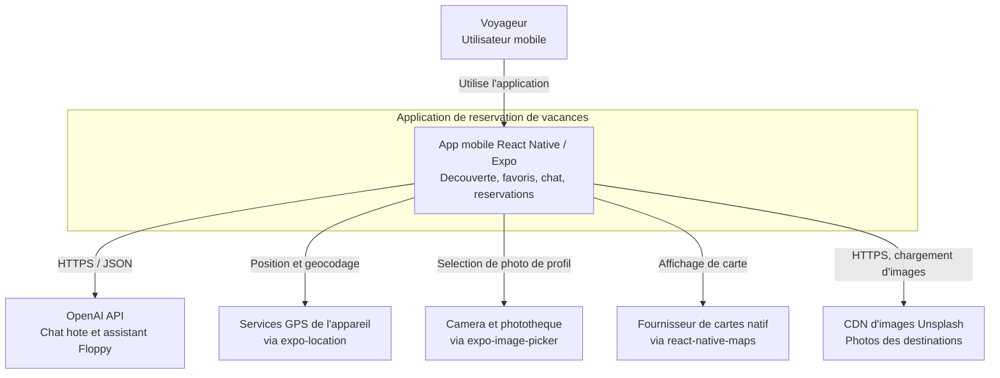
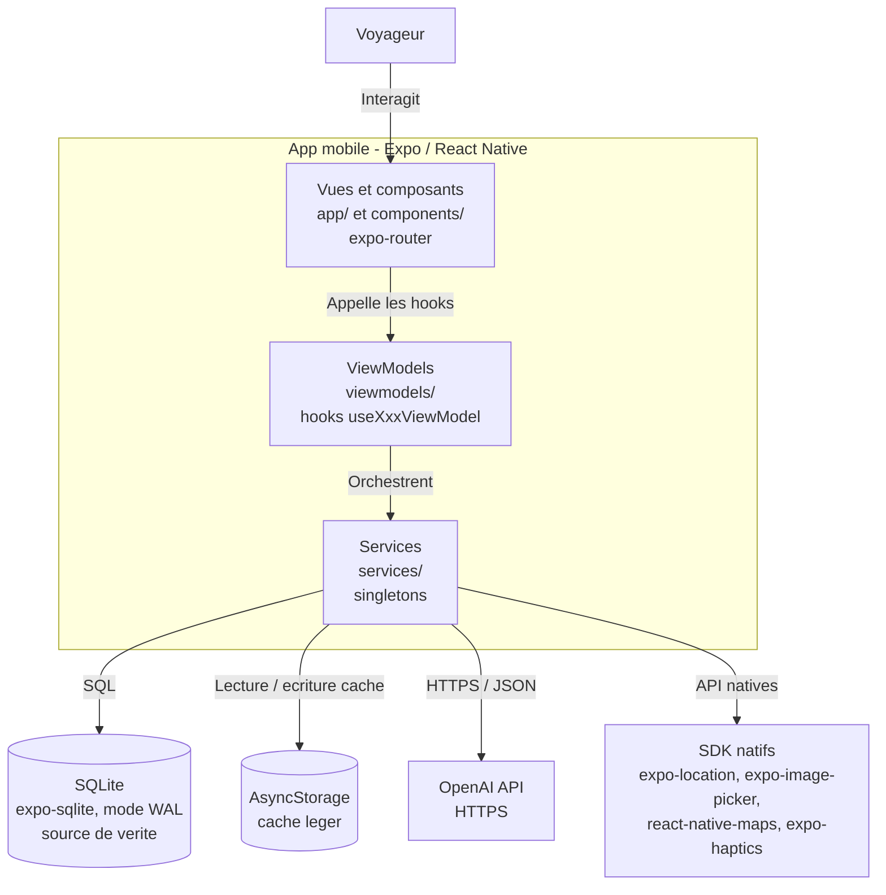
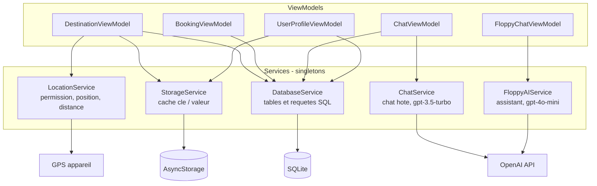
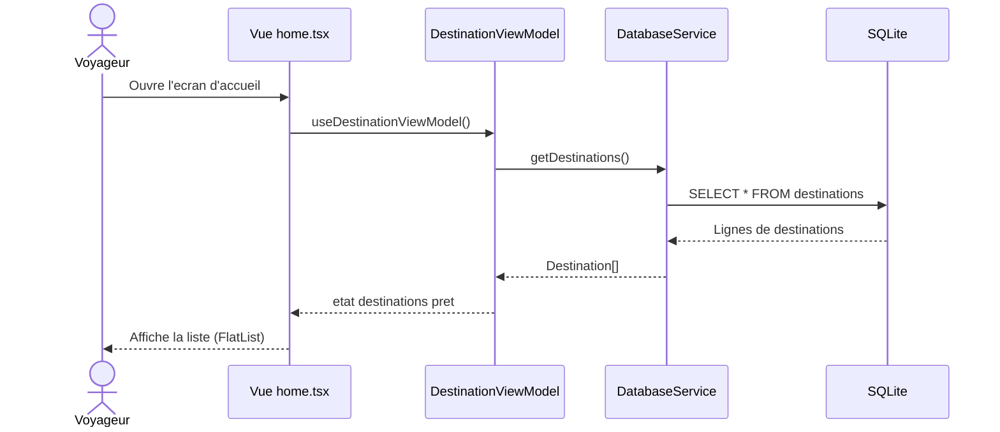
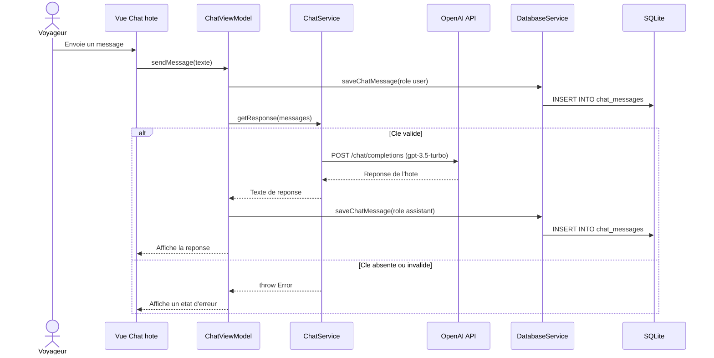
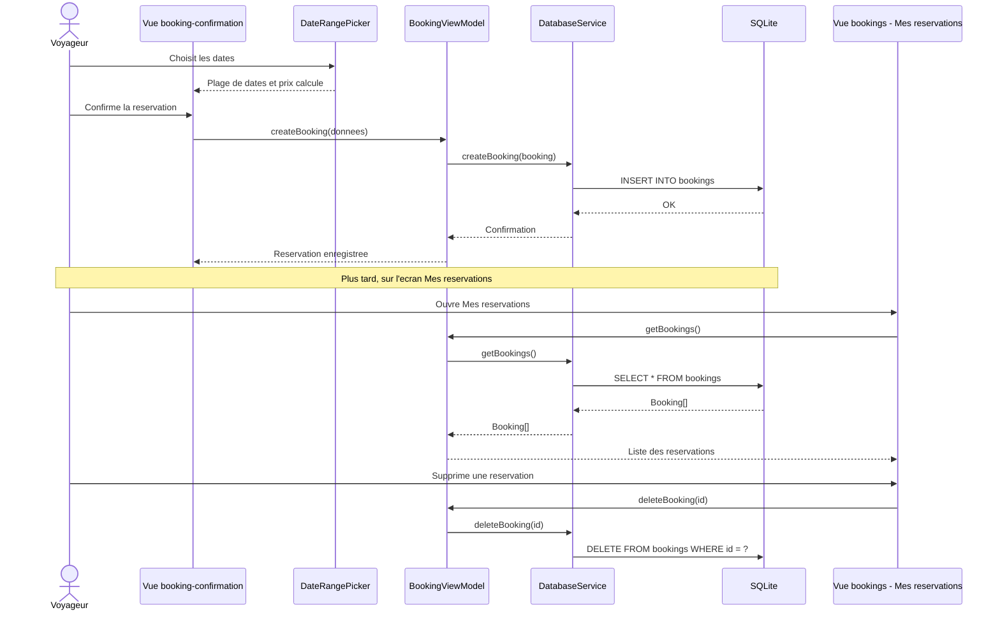

# Architecture du projet

Documentation technique de l'application mobile de réservation de séjours de vacances.

---

## 1. Introduction

Cette application mobile (React Native 0.81 + Expo SDK 54) permet à un voyageur de découvrir des destinations de vacances, de les filtrer et les rechercher, de gérer ses favoris, de discuter avec l'hôte d'un logement, de se faire assister par un agent conversationnel (Floppy) et de créer des réservations. Elle exploite plusieurs fonctionnalités natives du téléphone : carte interactive, géolocalisation, sélecteur de photos et retours haptiques.

L'application suit le patron d'architecture **MVVM** (Model - View - ViewModel). Les **Vues** (écrans `expo-router`) ne contiennent que de l'affichage et délèguent toute la logique à des **ViewModels** exposés sous forme de hooks React (`useXxxViewModel`). Ces ViewModels orchestrent des **Services** singletons (accès aux données, API externes, capteurs natifs) et exposent à la Vue un état prêt à l'emploi. Cette séparation rend la logique testable, réutilisable entre écrans et indépendante du rendu.

---

## 2. Vue d'ensemble des couches

| Couche | Dossier | Responsabilité | Exemples de fichiers |
| --- | --- | --- | --- |
| **Vues (View)** | `app/` | Écrans et navigation par fichiers (`expo-router`). Affichage pur, branche les hooks de ViewModel. | `app/(vacation)/home.tsx`, `app/(vacation)/destination/[id].tsx`, `app/(chat)/[destinationId].tsx` |
| **Composants** | `components/` | Composants d'UI réutilisables, sans logique métier. | `DateRangePicker.tsx`, `SearchFilters.tsx`, `FloppyChat.tsx`, `FloppyButton.tsx`, `AdBanner.tsx` |
| **ViewModels** | `viewmodels/` | Logique de présentation et d'orchestration, exposée en hooks React. | `DestinationViewModel.ts`, `BookingViewModel.ts`, `ChatViewModel.ts`, `FloppyChatViewModel.ts`, `UserProfileViewModel.ts` |
| **Services** | `services/` | Accès données, API externes et capteurs natifs (singletons). | `DatabaseService.ts`, `StorageService.ts`, `ChatService.ts`, `FloppyAIService.ts`, `LocationService.ts` |
| **Modèles (Model)** | `models/` | Interfaces TypeScript décrivant les entités du domaine. | `Destination.ts`, `Booking.ts`, `User.ts`, `Host.ts`, `Chat.ts`, `ChatMessage.ts`, `SearchFilters.ts` |
| **Contextes / Hooks** | `contexts/`, `hooks/` | État transverse (thème) et utilitaires d'UI. | `contexts/ThemeContext.tsx`, `hooks/use-color-scheme.ts`, `hooks/useAdBanner.ts` |
| **Constantes** | `constants/` | Palette de couleurs et thèmes clair/sombre. | `constants/Colors.ts` |

---

## 3. Diagramme C4 — Niveau 1 (Contexte système)

Ce niveau situe l'application dans son environnement : l'utilisateur (le Voyageur) interagit avec le système, qui s'appuie sur plusieurs systèmes externes.



**Explication.** Le Voyageur est le seul acteur humain. L'application communique avec OpenAI (génération de réponses de chat), avec les services GPS du téléphone (position et géocodage inversé), avec la caméra et la photothèque (photo de profil), avec le fournisseur de cartes natif (carte interactive) et avec le CDN Unsplash (images des destinations). Aucun back-end propriétaire n'est utilisé : les données métier sont stockées localement sur l'appareil.

---

## 4. Diagramme C4 — Niveau 2 (Conteneurs)

Ce niveau zoome sur l'application mobile et montre ses sous-couches internes ainsi que les magasins de données et systèmes externes.



**Explication.** L'application se découpe en trois sous-couches : les **Vues** (écrans et composants), les **ViewModels** (logique de présentation) et les **Services** (accès aux ressources). Le flux de dépendance est strict et descendant : une Vue n'appelle qu'un ViewModel, un ViewModel n'appelle que des Services, et seuls les Services touchent les magasins de données ou les systèmes externes. **SQLite** est la source de vérité (destinations, favoris, avis, hôtes, messages, profil, réservations) tandis qu'**AsyncStorage** sert de cache léger (favoris, préférences, profil). Les communications avec OpenAI passent en HTTPS/JSON, et les capacités natives sont exposées par les SDK Expo.

---

## 5. Diagramme C4 — Niveau 3 (Composants internes)

Ce niveau détaille les cinq Services et leurs liens avec les ViewModels et les ressources sous-jacentes.



**Explication.**

- **DatabaseService** centralise toutes les requêtes SQLite. Il crée les tables au démarrage (`user_profile`, `destinations`, `favorites`, `reviews`, `hosts`, `chat_messages`, `bookings`), active le mode WAL et amorce (`seed`) environ 80 destinations au premier lancement. C'est le service le plus sollicité, utilisé par presque tous les ViewModels.
- **StorageService** s'appuie sur AsyncStorage pour un cache léger (favoris, préférences, profil) qui accélère l'affichage initial sans recharger SQLite.
- **ChatService** gère le chat avec l'hôte via `fetch` direct vers OpenAI (`gpt-3.5-turbo`). Il lève une erreur si la clé `EXPO_PUBLIC_OPENAI_API_KEY` est absente ou invalide.
- **FloppyAIService** alimente l'assistant Floppy via le SDK `openai` (`gpt-4o-mini`). Il fournit des réponses de secours (fallback) lorsque la clé n'est pas configurée, afin que l'assistant reste utilisable hors ligne ou en démonstration.
- **LocationService** encapsule `expo-location` : demande de permission, position courante, géocodage inversé et calcul de distance (formule de Haversine) pour trier les destinations proches.

---

## 6. Flux de données (diagrammes de séquence)

### (a) Afficher la liste des destinations



La Vue se contente de monter le hook ; le ViewModel demande les données au DatabaseService, qui interroge SQLite. La Vue n'a jamais conscience du stockage : elle reçoit un tableau `Destination[]` prêt à afficher.

### (b) Ajouter ou retirer un favori (mise à jour optimiste)

```mermaid
sequenceDiagram
    actor U as Voyageur
    participant V as Vue Detail destination
    participant VM as DestinationViewModel
    participant DB as DatabaseService
    participant SQL as SQLite

    U->>V: Appuie sur le coeur
    V->>VM: toggleFavorite(id)
    VM-->>V: Met a jour l'UI immediatement (optimiste)
    alt Ajout
        VM->>DB: addFavorite(id)
        DB->>SQL: INSERT OR IGNORE INTO favorites
    else Retrait
        VM->>DB: removeFavorite(id)
        DB->>SQL: DELETE FROM favorites WHERE destination_id = ?
    end
    SQL-->>DB: OK
    DB-->>VM: Confirmation
    Note over VM,SQL: SQLite reste la source de verite ;<br/>l'UI a deja ete rafraichie
```

Pour une expérience fluide, le ViewModel applique une **mise à jour optimiste** : l'icône change instantanément, avant la confirmation de l'écriture. La persistance dans la table `favorites` se fait ensuite en arrière-plan.

### (c) Chat avec l'hôte



Chaque message (utilisateur et hôte) est persisté dans `chat_messages`, ce qui conserve l'historique de conversation entre sessions. Si la clé OpenAI est absente ou invalide, le ChatService lève une erreur que le ViewModel transforme en état d'erreur affiché à l'écran.

### (d) Créer une réservation



Le `DateRangePicker` fournit la plage de dates et le prix dynamique. À la confirmation, le `BookingViewModel` persiste la réservation via `DatabaseService.createBooking` dans la table `bookings`. L'écran « Mes réservations » lit ces enregistrements (`getBookings`) et permet leur suppression (`deleteBooking`).

---

## 7. Décisions d'architecture

- **MVVM.** Séparer Vue, ViewModel et Service garde les écrans déclaratifs et concentre la logique dans des hooks testables et réutilisables entre plusieurs écrans. Les Vues restent fines, ce qui facilite l'évolution de l'UI sans toucher à la logique métier.
- **SQLite comme source de vérité + AsyncStorage en cache.** SQLite (avec `expo-sqlite` en mode WAL) offre des requêtes relationnelles, un schéma typé et de bonnes performances pour ~80 destinations, avis, hôtes, messages et réservations. AsyncStorage complète ce dispositif comme cache clé/valeur léger pour accélérer l'affichage initial (favoris, préférences, profil) sans relancer une requête SQL.
- **expo-router (routing par fichiers).** L'arborescence du dossier `app/` définit directement la navigation. Les groupes `(vacation)`, `(chat)` et `(adv)` segmentent les parcours sans alourdir les URL, et le typage des routes réduit les erreurs de navigation.
- **Deux services OpenAI distincts.** Le chat avec l'hôte (`ChatService`, `gpt-3.5-turbo` via `fetch`) et l'assistant Floppy (`FloppyAIService`, `gpt-4o-mini` via le SDK `openai`) ont des besoins différents : persona, modèle, format d'appel et stratégie de secours. Les isoler évite de mélanger ces responsabilités et permet de faire évoluer chaque cas indépendamment.
- **Thème clair / sombre.** Un `ThemeContext` couplé à `constants/Colors.ts` et au hook `use-color-scheme` centralise la palette et propage le mode clair/sombre à toute l'application, garantissant une cohérence visuelle et un basculement instantané.
- **Caveat sécurité — clé OpenAI côté client.** Les deux services utilisent la clé `EXPO_PUBLIC_OPENAI_API_KEY`, exposée dans le bundle client (préfixe `EXPO_PUBLIC_`). C'est acceptable pour un projet d'apprentissage ou une démonstration, mais **à proscrire en production** : la clé est extractible du paquet applicatif. En production, les appels OpenAI devraient transiter par un back-end proxy qui détient la clé et applique des quotas.

---

## 8. Arborescence du projet

```
app-test/
├── app/                              # Vues + navigation (expo-router)
│   ├── _layout.tsx                   # Layout racine (ThemeProvider, Stack)
│   ├── index.tsx                     # Point d'entree -> onboarding
│   ├── (vacation)/                   # Parcours principal du voyageur
│   │   ├── _layout.tsx
│   │   ├── onboarding.tsx
│   │   ├── home.tsx
│   │   ├── all-destinations.tsx
│   │   ├── destination/[id].tsx      # Detail d'une destination
│   │   ├── favorites.tsx
│   │   ├── reviews.tsx
│   │   ├── profile.tsx
│   │   ├── conversations.tsx
│   │   ├── interactive-map.tsx
│   │   ├── booking-confirmation.tsx
│   │   └── bookings.tsx              # Mes reservations
│   ├── (chat)/                       # Chat avec l'hote
│   │   ├── _layout.tsx
│   │   └── [destinationId].tsx
│   └── (adv)/                        # Bannieres publicitaires
│       ├── _layout.tsx
│       └── offer-details.tsx
│
├── components/                       # Composants d'UI reutilisables
│   ├── AdBanner.tsx
│   ├── DateRangePicker.tsx
│   ├── FloppyButton.tsx
│   ├── FloppyChat.tsx
│   └── SearchFilters.tsx
│
├── viewmodels/                       # Logique de presentation (hooks)
│   ├── DestinationViewModel.ts
│   ├── BookingViewModel.ts
│   ├── ChatViewModel.ts
│   ├── FloppyChatViewModel.ts
│   └── UserProfileViewModel.ts
│
├── services/                         # Acces donnees, API, capteurs (singletons)
│   ├── DatabaseService.ts            # SQLite (expo-sqlite, WAL)
│   ├── StorageService.ts             # AsyncStorage (cache)
│   ├── ChatService.ts                # OpenAI gpt-3.5-turbo (chat hote)
│   ├── FloppyAIService.ts            # OpenAI gpt-4o-mini (assistant Floppy)
│   └── LocationService.ts            # expo-location (position, distance)
│
├── models/                           # Interfaces TypeScript du domaine
│   ├── Destination.ts
│   ├── Booking.ts
│   ├── User.ts
│   ├── Host.ts
│   ├── Chat.ts
│   ├── ChatMessage.ts
│   └── SearchFilters.ts
│
├── contexts/
│   └── ThemeContext.tsx              # Theme clair / sombre
│
├── hooks/
│   ├── use-color-scheme.ts
│   ├── use-color-scheme.web.ts
│   └── useAdBanner.ts
│
├── constants/
│   └── Colors.ts                     # Palettes clair / sombre
│
└── docs/
    └── ARCHITECTURE.md               # Ce document
```

> Note : l'application a été nettoyée de son squelette de départ (plus de groupe `(tabs)` ni de composants issus du template Expo). Les seuls composants restants sont ceux listés dans `components/`.
